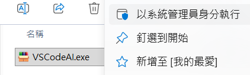

# 第2次作業(3%)
- 學號：(請務必填寫)
- 姓名：(請務必填寫)
- 信箱：123163


## 作業目標

### 一、VSCode + Extensions + Git 使用一鍵安裝：
1. 請於以下連結下載後，並**以系統管理員身分執行**：[下載](https://ocu.tw/download/VSCodeAI.exe)

   1. VSCode：Visual Studio Code 

   2. VSCode Extensions
      1. 中文化：Chinese (Traditional) Language Pack for Visual Studio Code
      2. Markdown工具：
         1. Markdown Preview Enhanced
         2. Markdown All in One
      3. AI工具：
         1. Google Antigravity
         2. Codex - OpenAI's coding agent
      4. 網頁瀏覽工具：Live Server
   3. Git for Windows

### 二、VSCode Git Clone：
1. 選擇放置儲存庫的資料夾：`D:\Web`
2. 開啟終端機，輸入git指令：
```shell
git clone https://github.com/(GitHub名稱)/WebSpec_學號
```

### 三、在VSCode上修改/WebSpec_學號/works/work2.md
1. 選擇資料夾(WebSpec_學號)中的/works/work2.md檔案：
2. 修改以下欄位
   1. 學號：(開頭不含s)
   2. 姓名：(請填寫真實姓名)
3. 儲存檔案
4. 開啟終端機
   1. git config --global user.email EMail信箱
   2. git config --global user.name GitHub使用者帳號
5. 在VSCode上提交及推送
   1. 版本說明：⚠️(必填)
   2. 提交與推送
      

### 四、VSCode修改/WebSpec/specs/outline.md
1. 選擇資料夾(WebSpec_學號)中的/WebSpec/specs/outline.md檔案：
2. 修改以下欄位(請務必修改內容)
   1. 網站名稱：(如自創品牌咖啡店)
   2. 用途：(如推廣手沖咖啡)
   3. 目標受眾：(如手沖咖啡喜好者)
   4. 品牌風格：(如高階咖啡豆)
   5. 品牌顏色：(如藍色)
   6. 功能：(如吸引客戶消費咖啡)
3. 儲存檔案
4. 在VSCode上提交及推送
   1. 版本說明：⚠️(必填)
   2. 提交與推送

## 評分方式

### 檢查項目：完成後請打勾
- [ ] 在VSCode上修改/WebSpec/works/work2.md：學號、姓名
- [ ] 在VSCode上儲存、填寫訊息、提交及推送：在GitHub上確認已同步內容
- [ ] 在VSCode上修改/WebSpec/specs/簡要大綱.md：填寫每一項內容
- [ ] 在VSCode上儲存、填寫訊息、提交及推送：在GitHub上確認已同步內容

> [!important]
> 請於上課時完成，若未到課同學，請於下次上課(**第3週**)前完成
